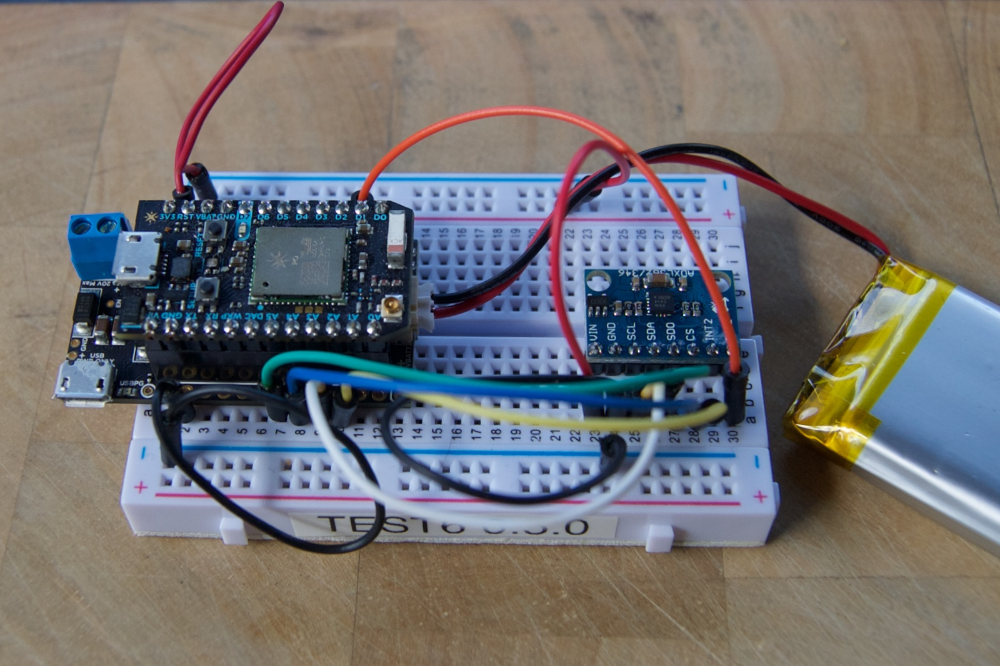

# AccelWake
*Sample of using ADXL362 accelerometer and Particle power shield to publish when a sleeping Photon is moved*



This is a simple project that uses an ADXL362 accelerometer to detect when the Photon is moved and wake it up from sleep and publish an event. It uses a Particle Power Shield to power the Photon from a 3.7V LiPo battery.

The ADXL362 is a low-cost 3-DOF (3-axis, 3-degrees of freedom) SPI accelerometer that's extremely low power. In the wake-on-move mode used here, it uses 270 nA. Yes, nano-amps!

The sensor is part of the Particle Electron Sensor Kit, but you can get one from [SparkFun] (https://www.sparkfun.com/products/11446) or on eBay.

If you are building this source, you will need to use two libraries. They are both in the Community Libraries on the Particle Build (Web IDE), and also here on github:

* [PowerShield] (https://github.com/spark/PowerShield)
* [ADXML362DMA] (https://github.com/rickkas7/ADXL362DMA)

There's an updated version of the code below for the Electron that uses the built-in Electron FuelGauge instead of the PowerShield.

Make the following connections between the ADXL362 breakout and the Photon:

* VIN: 3V3
* GND: GND
* SCL: A3 (SCK)
* SDA: A5 (MOSI)
* SDO: A4 (MISO)
* CS: A2 (SS)
* INT1: D2
* INT2: no connection

Under normal operation about 10 seconds after you boot or flash the code, the Photon will go to sleep. When movement is detected it will wake up, publish an event with data something like:

```
1,4.06,98.29
```

That means the movement was detected (1) and the battery voltage is 4.06 volts and the state of charge is 98.29 %.

Then the Photon will go back to sleep (even if it's still in motion). If there's no Wi-Fi or cloud connnection, it will try for 30 seconds then go to sleep, discarding the data.

It will also publish a battery status event at boot and every 4 hours; the first comma-separated field will be 0 (no movement).

## Electron

I made a few minor modifications and now it works great on the Electron, too. I removed the PowerShield support and used the [FuelGauge] (https://docs.particle.io/reference/firmware/electron/#fuelgauge) instead. I also increased the timeout to get online from 30 to 60 seconds, since it takes longer for cellular data to come up.

The source is in accelwake_electron.cpp.


